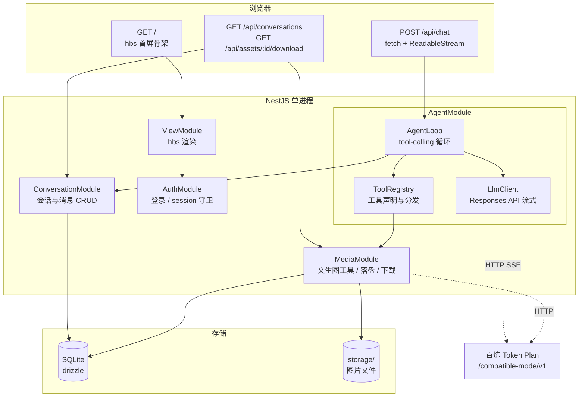
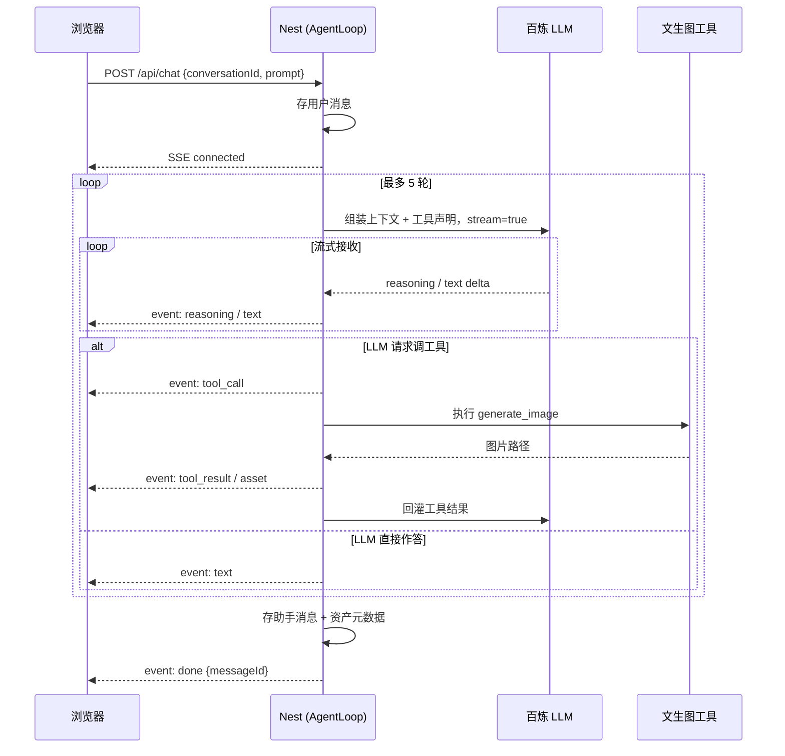
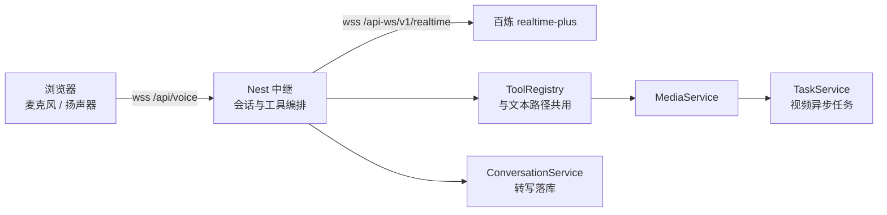

# kestrel-studio 架构设计

> 本文只回答一个问题：**这个系统是什么**——定位、选型、分层、关键设计决策与数据模型。
> 其余关注点已拆为独立文档，见文末「相关文档」。

## 1. 定位与命名

`kestrel/` 是 Rust 实现的 Agent harness 内核。`kestrel-studio` 是它面向**生成式媒体**的 Web 化实现：
用户在网页里给一句话，LLM 流式思考、调用生成工具、把产出的图片或视频渲染到页面上，可预览可下载。
能力按轮次分四种模式——对话（零工具）、图片、视频，另有智能模式由模型自行路由；**语音另有一条
独立入口**（`/voice`），不是第五个模式，理由见 §11。

语言从 Rust 换成 NestJS，但「Agent 循环 + 工具注册表」的分层思路沿用 kestrel。

参考实现：`playground/bailian-media-mcp`（百炼 Token Plan 文生图/文生视频的 MCP 封装）。
那里的 API 调用方式与凭据解析策略可直接复用；MCP 协议外壳不复用。

## 2. 技术选型

| 层 | 选型 | 理由 |
|---|---|---|
| 服务端 | NestJS 12 + Express | 指定 |
| 渲染 | hbs (Handlebars) | 单进程 SSR，无独立前端服务，8G 机器内存友好 |
| 前端 | 原生 TS + Vite 打包 | 无框架，Vite 只做 TS/CSS 打包，产物由 Nest 静态托管 |
| 传输 | SSE over POST | 单向流式，比 WebSocket 简单；手写解析以支持 POST 与 abort |
| 实时语音 | 裸 `ws` + 短时效票据鉴权 | 见 §11。只要裸 WS 的帧控制，不引入 socket.io 及其自有协议 |
| 数据库 | SQLite + drizzle-orm + better-sqlite3 | 轻量、类型安全、无 Prisma 的引擎二进制开销 |
| 登录 | express-session + passport-local + bcrypt | SSR 下 session cookie 比 JWT 自然 |
| 账号与权限 | `users.role` 单列 + 一处可见性规则 | 见 §12。只有一级特权，不引入角色表与权限中间件 |
| LLM 客户端 | 手写 fetch + SSE 解析（依据见 [verification.md](verification.md) §1） | Token Plan 兼容 OpenAI 协议，但端点带非标准注释行 |

## 3. 分层架构



## 4. 关键设计决策

### 4.1 SSR 与流式渲染是两条独立的路

hbs 只负责渲染首屏骨架：登录态判断、历史会话侧栏、页面外壳（顶栏 / 主体区 / 底部输入区）。
**主体区域从第一个 token 起就全部由客户端 JS 拼 DOM**，服务端不流式吐 HTML 片段。
这条边界必须在实现时守住，否则容易出现「服务端模板里塞了流式占位逻辑」的拧巴写法。

### 4.2 用 fetch + ReadableStream 读 SSE，不用 EventSource

`EventSource` 只支持 GET、不能带自定义 header，而发消息需要 POST 一段 JSON。
因此前端用 `fetch` + `ReadableStream` 手动按 `\n\n` 切分 SSE 帧。
附带好处：可主动 `abort()`、可携带 CSRF token。

Nest 侧用 `@Res()` 裸写 `text/event-stream` 响应，不使用 `@Sse()` 装饰器（它只支持 GET）。

### 4.3 心跳与超时

文生图单次耗时几十秒，期间没有任何数据帧，长连接会被中间层或浏览器判定为空闲而掐断。

- **心跳**：每 15s 发一个 `: ping` 注释帧（SSE 规范中以 `:` 开头的行为注释，客户端会忽略）。
- **工具超时**：单次工具执行设上限（文生图 120s）。超时不挂死连接，而是推
  `tool_result {ok: false}` 把失败事实回灌给 LLM，由它决定重试还是换 prompt。

### 4.4 reasoning 实测可用

已实测（2026-09-20）：`deepseek-v4.1-flash` 在 Responses API 上以 `response.reasoning_text.delta`
事件流式吐思考内容，正文走 `response.output_text.delta`。两者事件名前缀不同，
前端可分列渲染——思考过程进折叠区，正文进主体区。

降级兜底：若日后模型换成不吐 reasoning 的版本，思考区退化为**工具调用步骤时间线**
（「正在生成图片… → 完成，耗时 23s」）。
前端事件模型不变，只是内容源从 `reasoning` 事件切换为 `tool_call` / `tool_result` 事件。

## 5. 数据模型

| 表 | 字段 |
|---|---|
| `users` | id, username, password_hash, role, created_at |
| `sessions` | sid, sess, expire —— 由 better-sqlite3-session-store 独占管理，不纳入 drizzle schema |
| `conversations` | id, user_id, title, deleted_at, created_at, updated_at |
| `messages` | id, conversation_id, role, content, reasoning, tool_calls, created_at |
| `assets` | id, message_id, kind, file_path, source_url, mime, bytes, created_at |

设计要点：

- 登录会话由 better-sqlite3-session-store 独占写入 `sessions` 表。drizzle schema 故意不建模它，
  避免两个写入方共管同一张表。
- **用户侧的"删除会话"是软删除**：只写 `conversations.deleted_at`，消息、资产与磁盘文件一律不动，
  于是超管那边整段历史仍可读（见 §12）。真要抹掉数据的是**删除账号**那条路径，它走硬级联。
  两者的实现分别是 `softDeleteConversations()` 与 `deleteConversations()`，同一个 service 里并存，
  用途写在各自己的注释里。
- `reasoning` 与 `tool_calls` 单独存列（`tool_calls` 为 JSON 文本），
  目的是刷新页面或重进会话时能完整回放思考过程，而不只剩最终文本。
- 图片二进制不入库，只存元数据 + **文件名**，避免单库文件膨胀。
  `assets.file_path` 存的是文件**名**，读取时按运行中的 `STORAGE_DIR` 解析
  （`src/media/asset-path.ts`）——目录是运行环境的属性，写进数据就等于绑死一次部署。
  搬迁前写入的绝对路径仍被兼容：文件还在原处就原样用。踩坑经过见
  [implementation-notes.md](implementation-notes.md) §7。
- 初始化时 seed 账号（`admin` 本地引导账号；超管凭据来自 `SUPER_ADMIN_*` 环境变量），
  密码经 bcrypt 哈希后入库，不存明文。`NODE_ENV=production` 下 `admin` 不建号。
  约束与权限模型见 §12。

## 6. Agent 循环



一轮最多 5 次 LLM 往返，防止工具调用死循环。
每轮的工具结果都以 `tool_result` 事件同步推给前端，用户能看到「思考 → 调工具 → 拿结果 → 再思考」的全过程。

### SSE 事件表

| event | data | 说明 |
|---|---|---|
| `connected` | `{conversationId}` | 流已建立；新会话时前端据此更新会话与侧栏 |
| `reasoning` | `{delta}` | 模型思考增量 |
| `text` | `{delta}` | 助手正文增量 |
| `tool_call` | `{name, arguments, status}` | 开始调用工具 |
| `tool_result` | `{name, ok, summary}` | 工具执行结果 |
| `asset` | `{id, kind, url, mime, bytes}` | 生成出的图片 |
| `done` | `{conversationId, messageId}` | 本轮结束 |
| `error` | `{message}` | 出错 |

## 7. 工具集

一期只上 `generate_image(prompt, size, model, count)`。

视频三件套（`generate_video` / `get_video_task`）放二期：视频任务耗时从几十秒到几分钟，
与「多轮 tool-calling 循环」的交互语义需要单独设计（会话级异步任务 + 主动推送），
混进一期会把复杂度拉满。

## 8. 前端结构

无框架，但上构建工具。**一个页面一个入口**，`vite.config.mts` 的 `input` 键就是产物名：

| 文件 | 页面 | 职责 |
|---|---|---|
| `web/scripts/main.ts` | `GET /` | 发送、SSE 帧解析、增量渲染 DOM、图片预览（原生 `<dialog>`）、下载弹窗。约 1030 行，单文件 |
| `web/scripts/voice.ts` | `GET /voice` | 麦克风采集（AudioWorklet）、WS 客户端、音频播放、会话事件流订阅 |
| `web/styles/main.css` | 两者共用 | 布局与主题，按 `:root` 变量 + 章节横幅组织 |
| `web/scripts/test-setup.ts` | — | 测试用，补 jsdom 缺失的 `scrollIntoView` |
| （无） | `/admin` 各页 | 管理页刻意不引客户端脚本：纯表单 + 302，见 §12 |

最终文本用 `marked` 渲染；思考过程按纯文本流式追加，不解析。模板只负责首屏骨架，其余全部由
客户端拼 DOM（见 §4.1）。

页面布局（用户给定）：

```
+------------------------------------------------------+
| [红隼 logo]  菜单区                     账号信息区   |
+------------------------------------------------------+
|                                                      |
|                主体区：流式渲染内容                  |
|                                                      |
|                                                      |
+------------------------------------------------------+
|            [ 输入框                    ] [ 发送 ]    |
+------------------------------------------------------+
```

## 9. 目录结构

```
kestrel-studio/
  Makefile              命令入口（make help 列全部）
  package.json
  pnpm-workspace.yaml   pnpm 12 的 allowBuilds 配置（放行原生模块构建脚本）
  tsconfig.json         后端；tsconfig.test.json 覆盖测试
  nest-cli.json         assets 把 view/views/** 拷进 dist
  drizzle.config.ts
  vite.config.mts       前端打包：一个页面一个入口
  Dockerfile            服务器上零下载构建（见 deployment.md §1）
  docker-compose.yml
  scripts/              deploy.sh / bootstrap-host.sh
  docs/
    README.md             文档索引与维护约定
    architecture.md       本文：系统设计与关键决策
    roadmap.md            产品扩展、内核选型与分期
    implementation-notes.md  实现期环境踩坑台账
    deployment.md         服务器部署与运维
    verification.md       端点实测与端到端验证
  src/
    main.ts              入口：装配 hbs / session / passport / 静态资源
    alias-bootstrap.ts   运行时别名注册，必须是入口的第一个 import
    app.module.ts
    config/              环境变量读取
    database/            drizzle 连接、schema、建表 DDL、admin seed
    bailian/             凭据解析、Responses API 流式客户端
    auth/                本地登录、session 序列化、守卫
    conversation/        会话、消息与资产的 CRUD 与投影
    agent/               AgentLoop、模式表、工具注册表
    media/               文生图 / 视频任务提交、文件落盘
    task/                异步任务：任务表、事件扇出、后台轮询 worker
    voice/               语音：协议、上游 WS 客户端、编排、网关、票据
    chat/                SSE 端点、图片下载端点、签名帧端点
    admin/               账号管理：超管守卫、账号 CRUD、管理页控制器
    view/                hbs 控制器与共用的模板预处理（render.ts）
      views/             chat.hbs / voice.hbs / login.hbs / admin*.hbs / partials/turn.hbs
    common/              SSE 写入与解析、工具参数读取、错误描述、签名 URL
    types/               .d.ts 声明（express / session store）
  web/                   前端源码
    public/logo.svg      静态资源，由 Vite 复制
    scripts/main.ts      对话页：SSE 解析、流式渲染、图片预览
    scripts/voice.ts     语音页：采集、WS、播放
    styles/main.css      两页共用
    vite-env.d.ts
  public/                Vite 产物 + logo（构建生成，gitignore）
  data/                  sqlite 文件（gitignore）
  storage/               生成的图片与视频（gitignore）
```

## 10. 配置与凭据

沿用 `bailian-media-mcp` 的策略：`BAILIAN_API_KEY` 环境变量优先，回退读 cc-switch 库中的
`bailian-token-plan` provider。这样切换 provider 不需要改配置，key 也不会落到仓库文件里。

配置来源有两层，顺序不能反：入口先由 `src/config/env-file.ts` 把项目根的 `./.env`（git 忽略，
镜像内不存在）**叠加**进 `process.env`——只填没有的键，绝不覆盖真实环境；之后
`configuration.ts` 才是唯一的读取点。所以线上容器（docker `env_file` 注入、镜像里没有 `.env`）
与本地（可选的 `.env`）走的是同一套语义，差别只在叠加层有没有文件。

| 变量 | 说明 |
|---|---|
| `BAILIAN_API_KEY` | 可选，未设时回退读 cc-switch 库 |
| `BAILIAN_BASE_URL` | 默认 Token Plan 端点 |
| `BAILIAN_CHAT_MODEL` / `BAILIAN_REASONING_EFFORT` | 文本轮次的模型与思考档位 |
| `BAILIAN_VIDEO_MODEL_T2V` / `_I2V` | 文生视频 / 图生视频模型 |
| `BAILIAN_VOICE_MODEL` | `/voice` 的实时语音模型。WS 地址由 `BAILIAN_BASE_URL` 换协议头得来（见 §11.1） |
| `PUBLIC_BASE_URL` | 图生视频交给供应商取首帧的公网前缀；签名帧 URL 由 `common/signed-url.ts` 拼出 |
| `DATABASE_FILE` | 默认 `data/kestrel-studio.db` |
| `PORT` | 默认 8848 |
| `NODE_ENV` | `production` 时不 seed 本地引导账号 `admin`（Dockerfile 设置） |
| `SESSION_SECRET` | express-session 签名密钥，同时用于资产帧 URL 签名。**无内置默认值**：`NODE_ENV=production` 下缺失即启动失败，本地每进程随机 |
| `STORAGE_DIR` | 图片落盘目录，默认 `storage/` |

## 11. 语音：第二条传输通路

语音是**与对话界面并列的独立入口**（`GET /voice`），**不是第五个模式**。理由是模式的语义决定的：
"模式"是**每一轮的属性**（见 [roadmap.md](roadmap.md) §2.4.3），而实时语音是一段**持续的双向
会话**，没有"提交—完成"的轮次边界。塞进模式选择器就得改造轮次模型本身，换来只是省一个入口。

代码在 `src/voice/`（协议、上游客户端、编排、网关）与 `web/scripts/voice.ts` + `views/voice.hbs`。
上游协议细节与实测数据见 [verification.md](verification.md) §3、§4，本节只写结构。

### 11.1 链路



**服务端代理是必须的，不是可选优化**：Token Plan 的凭据不能进浏览器。两端都是 WebSocket，
服务端只做转发与编排，**不做音频编解码**——音频在两个方向上都是 base64 的裸 PCM16 单声道 24kHz，
上游给的字符串原样转给浏览器。

线上还需要一个**单独的 nginx location**（`location = /api/voice`）：现有反代片段为了让 SSE 保持
普通长连接而显式清空了 `Connection`，那会一并杀掉 WS 的 upgrade。见 [deployment.md](deployment.md) §3。

### 11.2 鉴权：一次性票据，不在 upgrade 里碰 session

WebSocket 的 upgrade 不经过 Express，所以 `AuthenticatedGuard` 对它无效，而 session store 只活在
`main.ts` 的闭包里、也不在 DI 容器中。这里没有去 upgrade 路径里解析 cookie 查 session，而是：

1. `POST /api/voice/ticket`（挂现有守卫）签发**单次使用、60 秒有效、绑定 userId** 的票据；
2. 浏览器用它连 `wss /api/voice?ticket=…`，网关在 upgrade 时校验并作废。

这与 `common/signed-url.ts` 是同一个形状——**守卫够不着调用方时，改用短时效令牌**。区别只是这里
用内存 Map 而非 HMAC，因为不需要跨进程或存活过重启。

网关从 `onApplicationBootstrap` 里挂到 HTTP server 的 `upgrade` 事件上（不是从 `main.ts`）：这样
测试里 `init()` 就能触发它，且 `app.listen()` 是 `init()` + `listen()`，监听前处理器已就位。它是
**唯一**的 upgrade 监听者，因此每一个 upgrade 都必须由它终结——非 `/api/voice` 的路径会被显式拒绝，
放任不管会让 socket 挂到超时。

### 11.3 工具编排：成批处理，且必须等回执

一次响应可能包含多个 `function_call`，所以在 `response.done` 时才统一分发（在第一个
`arguments.done` 就动手会让 `response.create` 发得太早）。工具执行与文本路径**共用**
`ToolRegistry.execute()`，包括 120 秒超时与 abort 转发。

回灌 `function_call_output` 之后有**一条硬契约**：必须等该回执的 `conversation.item.created` 到达，
再发 `response.create`；同一 tick 内连发会让模型把同一次工具调用重发一遍（实测踩到过）。这条以及
"推挽模式下 `commit` 之后服务端不会自动应答，必须显式 `response.create`"都记在
[verification.md](verification.md) §4。

### 11.4 持久化与结果呈现在两条渠道上

- **转写与助手发言落 `messages`**，`mode` 写 `null`——语音不属于四种模式中的任何一种，落库是为了
  历史与 UI 回放（所以 `MessageView.mode` 是 `Mode | null`，`mode` 列本就可空）。语音**不把历史
  回放给模型**：上游会话自带上下文，落库不参与模型输入。
- **图片走语音 socket 推**：语音会话没有轮次 SSE 流，而图片要在通话中立刻看到。
- **视频走现有的会话事件流**（`GET /api/conversations/:id/events`）：一次渲染几分钟，届时通话早已
  结束，`task.worker` 会把结果作为新消息追加并推送——与文本路径完全一致。**注意现有的会话事件流
  不承载图片资产**（文本路径的图片走的是轮次流），所以两条渠道各司其职，不能只留一条。

### 11.5 边界

- 不做第五个模式（见 §11 开头）。
- 不改现有轮次 / SSE 抽象：语音是一条独立通路，文本路径不受影响。
- 不做独立 ASR / TTS：实测确认 `qwen-audio-3.0-asr-flash` 与 `qwen-audio-3.0-tts-plus` 在本
  Token Plan 上无可用路由，转写与合成只能由 realtime 会话提供——因此连"只做语音输入"也绕不开 WS。
- 未做的：**打断**（按住说话不会中断正在播的语音）、空闲保活（上游 180 秒无响应即关闭，客户端改为
  重连）、并发通话数未评估。见 [roadmap.md](roadmap.md) §3。

## 12. 账号与权限

多账号，但**只有一级特权**：`users.role` 取 `super` | `user`，`src/auth/roles.ts` 是取值、标签与
可见性判定的唯一真源。不引入角色表，也不引入权限中间件——只有两条规则，写在一处比抽象更可靠。

| 能力 | 普通账号 | 超级管理员 |
|---|---|---|
| 自己的会话（读 + 写） | 是 | 是 |
| 普通账号的会话（**只读**） | 否 | 是 |
| 另一个超管的会话 | 否 | **否** |
| 把自己的会话从历史里删掉（软删除） | 是 | **否** |
| 账号管理（建号 / 重置密码 / 删除） | 否 | 是 |

两条规则值得单独说明：

- **可见性只放宽"读"。** 写路径（`POST /api/chat` 的发轮次、语音建会话）始终要求 `isOwnedBy`：
  超管能看别人的会话，但发不进消息——否则一个手滑的 conversationId 就会污染别人的历史。
  规则在 `ConversationService` 里落成两个方法：`canRead()`（读，含资产下载）与 `isOwnedBy()`（写），
  两者的 SQL 条件由同一个私有的 `readableBy(viewer)` 生成。
- **超管的会话连别的超管也看不到。** 判据取的是**被访问方**的角色：join `users` 后看会话属主的
  role 是否为 `user`，而不是只看访问方自称的身份。于是"超管的 session 只有超管自己可见"
  对超管之间也成立。

| 位置 | 职责 |
|---|---|
| `src/auth/roles.ts` | 取值、中文标签、`parseRole()`（未知值降级为 `user`）、`isSuperAdmin()` |
| `src/admin/admin.guard.ts` | `/admin` 的门：未登录 → `/login`；非超管 GET → `/`、POST → 403 |
| `src/admin/admin.service.ts` | 账号列表与 CRUD、级联删除、密码哈希与形状校验 |
| `src/admin/admin.controller.ts` | 页面与表单端点，服务端渲染 POST + 302 + `?notice=` 提示 |
| `src/conversation/conversation.service.ts` | 可见性规则本身：`canRead()` / `isOwnedBy()`（共用私有的 `readableBy()`）、`softDeleteConversations()`、硬级联 `deleteConversations()` |

- **两个账号**：`admin`（普通用户，凭据代码内置但**生产环境不建号**）与超管（凭据只来自
  `SUPER_ADMIN_USERNAME` / `SUPER_ADMIN_PASSWORD`，**仓库里不内置超管口令**，缺省即不建号），启动时按需建出，
  **只在缺失时创建**——重启不会把改过的密码重置回去。
- `role` 在 `DDL` 与 `ADDED_COLUMNS` 两处都写：老库由 `ALTER TABLE … DEFAULT 'user'` 补列，
  于是所有既有账号自动落到最小权限，无需数据迁移。
- 删除账号是**级联**的：资产行 → 任务行 → 消息 → 会话 → 账号，最后删库外文件
  （只删 `STORAGE_DIR` 以内的路径，越界路径跳过）。拒绝删自己与删最后一个超管。
- 管理页**不加载任何客户端脚本**：纯表单 + 302 + 提示码，与 `/login` 同形。刻意的选择——
  这条通路不跑 JS，于是既没有控制台噪音，也没有"第二套渲染逻辑"要维护。
  代价是表单里必须放一个**可见**的账号名输入框（隐藏字段不算数），否则 Chrome 会对
  密码框报 DOM 提示，实测过程见 [verification.md](verification.md) §5。

### 12.1 用户侧的删除是"隐藏"，不是"抹掉"

历史会话下拉里的删除（`POST /api/conversations/:id/delete`）只写 `deleted_at`：

| 谁 | 结果 |
|---|---|
| 会话属主（普通账号） | 从侧栏、`/api/conversations`、消息回放、资产下载里全部消失；`?c=` 指过去会退回最近一个会话 |
| 超级管理员 | 在 `/admin/conversations` 里照旧看到，带「已删除 · 时间」标记；只读回放整段仍在，图片能打开 |

- **行内二次确认**：第一次点「删除」只把那一行换成「确认 / 取消」，第二次点「确认」才发请求。
  不是 `window.confirm`——答案落在它针对的那一行旁边，这条通路也仍然不引入原生对话框。
- **只给普通账号**：超管的侧栏不渲染删除控件，端点对超管返回 403（对别人则是 404，不确认存在性）。
  理由是它存在的意义就是让用户整理自己的历史，而超管本来就看得见全部；真要抹掉数据，
  走账号删除那条硬级联。
- **比硬删除安全得多**：行没有消失，只是在属主视图里不可见，所以"生成中被删"不会留下半截状态——
  任务回填、`finalizeAssistant` 照常落在原处，只是不再显示给属主。

实测证据（浏览器里的两次点击、超管侧的标记与回放、库里的行数）见
[verification.md](verification.md) §6。

## 13. 相关文档

全部文档的索引、各自负责的范围与维护约定见 [docs/README.md](./README.md)。
索引只此一处，避免多份清单互相漂移。
