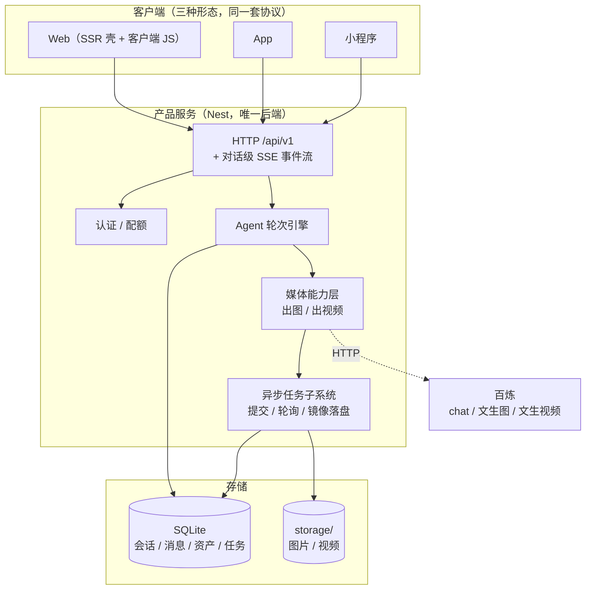

# kestrel-studio 产品扩展规划

> 本文只回答一个问题：**要往哪走**——能力扩展、多端形态、内核选型与分期。
> 与 [architecture.md](./architecture.md) 的分工：那份描述系统**现在是什么**且很少变动；
> 这份描述系统**将变成什么**，会随讨论频繁改写。

## 1. 分期

一期已完成并上线（登录 → 单会话 → 文生图 Agent 循环 → SSE 流式渲染 → 预览下载）。
原定的二期「多会话历史管理、视频工具」中，**多会话历史管理已随一期落地**（历史会话侧栏、
会话列表接口、SSR 历史回放均已验证）；其余被 §2 的产品扩展设计修订，修订后的分期如下。

| 期 | 内容 | 理由 | 现状 |
|---|---|---|---|
| 一 | 上述一期内容 | 已完成 | 端到端已验证（[verification.md](verification.md) §2） |
| 二 | 抽出 `/api/v1` + 对话级 SSE（含断线续传）+ 三模式 | 直接服务多端目标，不依赖内核决策，做完不返工 | 三模式**已落地**（模式选择器 + 按轮次存储与回放）；`/api/v1` 与 SSE 续传**未做**——对话级长连接已有，缺 `seq` 与 `Last-Event-ID` |
| 三 | 异步任务子系统 + 视频能力 | 独立子系统，与内核决策解耦 | **已落地**，见 `src/task/`（提交即返回、后台轮询、成功即镜像、追加消息并推送）；端到端未记录 |
| 四 | **语音会话**（独立入口 + 工具调用） | 与内核决策无关，走 §2.4.1 之外的一条独立通路。设计已迁至 [architecture.md](./architecture.md) §11 | **已落地**，本地与线上端到端实测均通过（[verification.md](verification.md) §4） |
| 五 | 内核选型落地（保持 TS 增强 / 引入 Rust sidecar） | 前面各期完成后，内核的真实收益才有可比基准 | 未开始 |

二期至四期无论内核如何选型都不会白做。

## 2. 产品扩展设计（2026-09-22）

一期上线后的扩展方向：从「单一文生图」扩展为**对话 / 生成图片 / 生成视频**三种能力，
并把 Web 从「唯一宿主」降级为**第一个客户端**，为 App / 小程序留出接入位。

### 2.1 已定的产品决策

| 决策项 | 结论 |
|---|---|
| 能力呈现形态 | 模式选择器 + 自动路由：默认可由模型自行判断走哪条路，用户显式选择时收窄工具集强制约束 |
| 会话与模式的关系 | 同一会话内可自由切换；模式是**每一轮的属性**，不是会话的属性 |
| 多端预期 | App / 小程序在明确规划内，按多端消费来设计边界 |

### 2.2 内核选型裁决：kestrel(Rust) 暂不引入

结论：**kestrel 可以作为内核，但当前引入是负收益。** 关键依据（均经源码核实）：

| 项 | 事实 | 影响 |
|---|---|---|
| 无历史灌入入口 | `SessionStore::prompt_items()` 零调用点；`Shared.history` 恒从空开始，只有 `Op::Turn`/`Op::Steer` 两个入口且都会触发采样 | 多轮对话直接做不了，必须改 kestrel 源码 |
| `Tool` 无 `description()` | `ToolRegistry::specs()` 无条件写 `description: String::new()`（`tools/mod.rs:199-208`） | 模型只能看到参数 schema，看不到工具用途，出图质量下降 |
| 事件流单消费者 | `AgentHandle::take_event_rx()` 是 take-once | 多端订阅要自行加广播层 |
| 回合结果不可 await | `op_loop` 丢弃 `run_turn` 的返回值，只能靠 `TurnComplete` 事件侧面推断 | 需自建 oneshot 层 |
| 无服务层 | 全仓库唯一 listener 是 `bus/rpc.rs` 的 `UnixListener`；`kestrel serve` 不是 web server，是拨号连 hub 的 worker，结果只回 `result_ref` **文件路径** | 需自写 800~1500 行 sidecar |
| 无动态工具注册 | `docs/design.md` §1 将「插件/扩展系统」列为**非目标**，工具写死在 `run.rs`/`serve.rs` 的 `vec![]` | 每加一个产品能力都要改 Rust 并重走宿主机 Docker 交叉编译部署 |
| system prompt 不可变 | `shared.system` 固定在 `EngineConfig` | 三模式要换提示词，又一处补丁 |

进一步的模式性错配：

- **主产物没有通道**。`EventMsg` 中没有承载产物的位置，`ToolOutcome.content` 是回灌给模型的内容。
  一期里那个一等公民 `asset` 事件，在 kestrel 里只能塞进 `ToolUpdate` 的字符串走私——而媒体产品的**主产物就是资产**。
- **最值钱的部分用不上**。kestrel 的权限引擎与 Seatbelt 沙箱（约 2.5k 行，其最大工程量）全仓库只服务于
  `bash` 子进程（`tools/bash.rs:88` 是 `Sandbox::wrap` 的唯一调用点），本产品一行都用不到。
  （附带结论：**纯 Rust 原生工具走 `reqwest` 不受网络策略约束**，若真要引入，出图工具无需动沙箱。
  该结论由调用点反推得出，**尚未实机验证**。）

可作为正收益引入的时机：当产品的 Agent 复杂度上升到需要**星型多 Agent 编排**（如策划 Agent + 出图 Agent +
质检 Agent）时——那才是 kestrel 的形状。见 §2.6。

### 2.3 目标架构

决定多端能否复用的**不是内核语言，而是产品 API 边界**。当前 SSR 单体没有这条边界：`POST /api/chat`
把整个 agent 轮次挂在一条 HTTP 连接上流式返回，移动端断网、切后台、被系统回收都会让该轮作废。
因此无论内核如何选型，都必须先把「发送」与「订阅」拆开。



Web 只负责首屏骨架，其余全部走同一套 `/api/v1`；App 与小程序将来接的是同一套端点，产品逻辑无需重写。

### 2.4 三个必须做的变更

#### 2.4.1 轮次级 SSE 改为对话级 SSE

| 端点 | 语义 |
|---|---|
| `POST /api/v1/conversations/:id/turns` | 提交一轮，立即 `202` 返回 `turnId` |
| `GET /api/v1/conversations/:id/stream` | 对话级事件流，事件带自增 `seq`，支持 `Last-Event-ID` 断线续传 |

这是移动端可用的前提，同时把 2.4.2 的长任务推送一并解决。

#### 2.4.2 异步任务子系统

视频能力强制需要。已实证的两条硬约束：参考实现（`playground/bailian-media-mcp`）的视频流程是
**最长 240s 的阻塞轮询**（间隔 8s）；且**供应商返回的媒体 URL 是短时效的**，错过成功那一刻就再也取不回。
另有两条产品级缺陷需在自研实现中修正：任务 id 不落任何服务端存储（客户端丢失即永久丢失），
以及**无幂等**（客户端超时重试会重复计费生成）。

流程：

```
generate_video 工具 → 提交 provider 任务 → 立刻返回 task_id（不阻塞本轮）
                    ↓
              落 generation_tasks 表（status=queued）
                    ↓
        后台 worker 退避轮询 → SUCCEEDED → 立刻 fetch 字节镜像到 storage/
                    ↓                              ↓
              写 assets 行 + update task        （provider URL 就此抛弃）
                    ↓
        向该会话的 SSE 流推 task_progress / task_completed
```

要点：

- **Agent 那一轮在提交后立即结束**，不等待渲染。视频完成时由服务端往会话里**追加一条新的 assistant 消息**并推送。
  用户关掉页面再回来，任务照跑，回来能看到结果。
- `status` 用显式枚举落库，不得沿用参考实现把 `task_status` 当裸字符串的做法——它把「仍在跑」与「永久失败」
  都编码成人类可读文本，客户端只能靠字符串匹配区分。
- 媒体字节必须在成功那一刻镜像到 `storage/`，**不可把 provider URL 当持久引用**（一期 `assets.source_url` 保留，
  但仅作审计，明确不再取用）。

#### 2.4.3 模式按轮次而非按会话

`mode ∈ {auto, chat, image, video}`，存在该轮的记录上，历史回放时按轮次渲染。模式决定
**该轮暴露的工具子集** + **系统提示词片段**：

| 模式 | 工具集 |
|---|---|
| `auto` | 全部，由模型自选 |
| `chat` | 零工具 |
| `image` | `generate_image` |
| `video` | `generate_video` / `get_video_task` |

显式模式的作用是让扣费可预期——`auto` 下用户无法预知这一轮会不会生成。这条在 TS 里是每次请求组装
instructions 与 tools 的一行代码，在 kestrel 里则要改 `shared.system` 与工具列表两处写死点，是内核选型的缩影。

### 2.5 数据模型增量

一期 `users / conversations / messages / assets` 基本沿用，增量：

| 表 | 变更 |
|---|---|
| `messages` | 加 `mode`（该轮能力）、`seq`（对话内序号，供 SSE 续传） |
| `generation_tasks` | 新表：`id, conversation_id, message_id, user_id, kind, provider_task_id, model, prompt, params(json), status, attempts, error, asset_id, created_at, started_at, finished_at` |
| `assets` | 加 `task_id` 反查；保留 `source_url` 但仅作审计 |

### 2.6 回归路径：若日后引入 kestrel

若届时要走 Rust 内核，最小可行形态：

1. fork kestrel，打四处小补丁：`Tool::description()`（约 10 行）、历史灌入构造器（约 40 行）、
   事件广播扇出（约 30 行）、回合完成 oneshot（约 30 行）。
2. 新增 `serve-rpc` 子命令：在 UDS/HTTP 上暴露「会话 → `AgentHandle`」映射 + NDJSON 事件流。
3. **产品工具不使用原生 Rust 实现**，改用单个通用代理工具 `invoke_capability(name, args)` 回调宿主执行。
   这样媒体代码不出 Node，新增能力只改 Node，规避「无动态工具注册」的迭代税，资产通道也天然留在 Node 侧。

第 3 条是该方案能成立的前提，否则 §2.2 的账全部成立。

wire 层对接事实（供届时参考）：kestrel 只有 anthropic-messages 与 openai-completions 两条 wire，
**没有 openai-responses**——一期 chat 用的正是 Responses API，迁移后须改走 openai 兼容面。
百炼 Token Plan 主机同时提供 `/compatible-mode`（openai）与 `/apps/anthropic` 两个表面且凭据互通，
openai 面须置 compat 位 `stream_include_usage = true`，否则全程 `usage: null`。

## 3. 当前待办

- 红隼 logo 目前是占位 SVG（`web/public/logo.svg`），待替换为正式图片。
- 对话页有 1 条 Chrome *issue*：`Lazy-loaded images should have explicit dimensions`，来自
  `partials/turn.hbs` 里 `loading="lazy"` 的资产 ``。不是错误也不是警告，属既有代码；要修
  得先知道图片尺寸，而尺寸由模型选，暂无好办法，先记着。
- 语音的遗留项（设计与已落地的部分见 [architecture.md](./architecture.md) §11）：
  - **真实麦克风采集尚未验证**。客户端到服务端的帧序列已有测试与实测覆盖
    （`web/scripts/voice.test.ts`、[verification.md](verification.md) §7），剩下的是
    `getUserMedia` 那一步——它要弹权限框，需由人在 `/voice` 页按住按钮走一遍。
  - **打断（barge-in）未做**：上一句还在播时按住说话不会中断它。
  - **空闲保活未做**：上游 180 秒无响应即关闭会话（close code `1007`），现由客户端提示
    "再按一次继续"并重新取票重连——重连后上游上下文重置。
  - **并发通话数未评估**：每个通话占一条到浏览器的 WS + 一条到上游。
- **多账号与超管**：代码完成、本地实测、**线上已上线**（[verification.md](verification.md) §5、
  [deployment.md](deployment.md) §8）。`role` 补列与超管账号的创建都发生在**进程启动时**，
  所以本机那个常驻的 pm2 实例要等重启才会出现 `/admin` 与超管账号。
- 后端链路与前端控制台均已实测，本地与线上均通过，详见 [verification.md](verification.md)。
